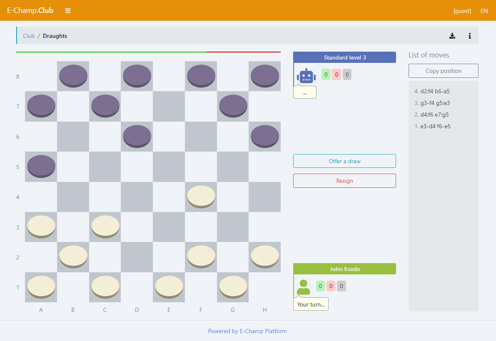

# E-Champ Draughts

### The Draughts is a online logical game.

This is a module for [E-Champ](https://github.com/mkhorin/e-champ) gaming platform.

The Draughts game implements the following features:

- Custom initial position
- Losing draughts variant
- Lots of bot difficulty levels
- Save current position

A detailed description and rules of the Draughts can be found
in [Wiki](https://en.wikipedia.org/wiki/Draughts).

